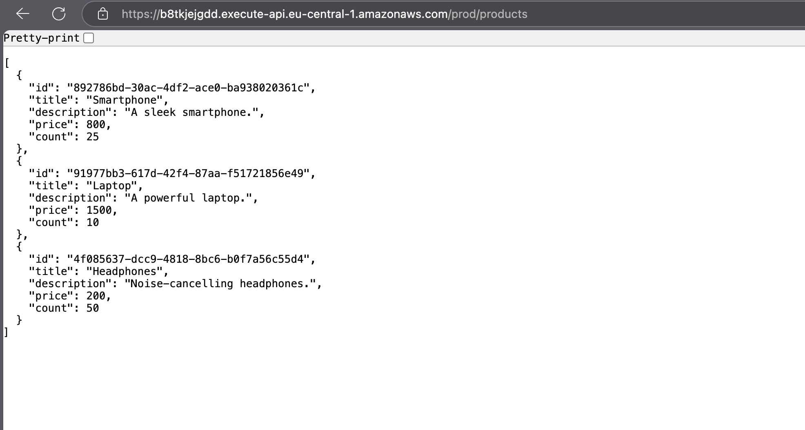
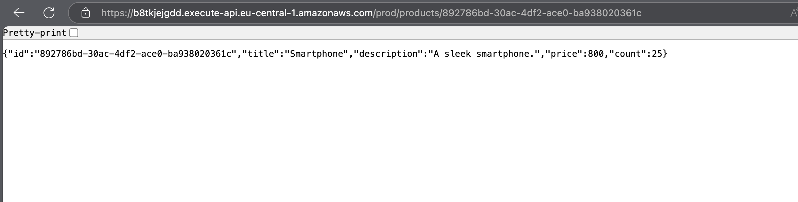
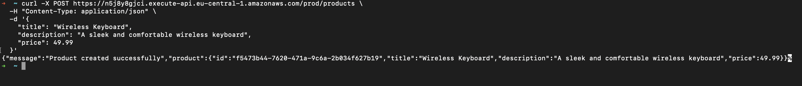
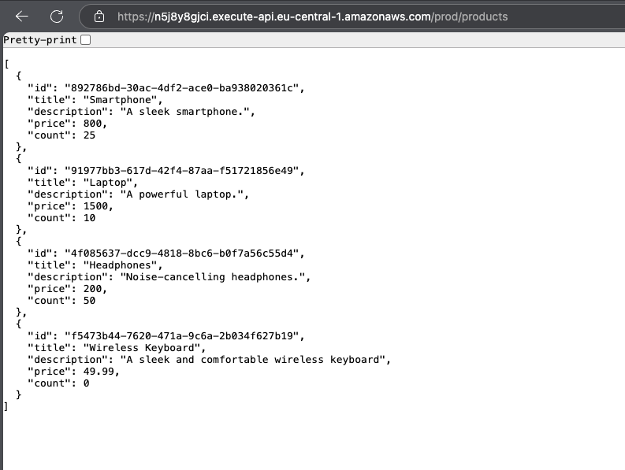

### task 4.1: Create DynamoDB Tables Using AWS Console

[Create DynamoDB Table](./script-task4.1/README.md)

### task 4.2: Create lambda function for getProductsList & getProductsById

## getProductsList

url:https://n5j8y8gjci.execute-api.eu-central-1.amazonaws.com/prod/products

[getProductsList API url](https://n5j8y8gjci.execute-api.eu-central-1.amazonaws.com/prod/products)

## getProductsById

url:https://n5j8y8gjci.execute-api.eu-central-1.amazonaws.com/prod/products

[getProductsById API url](https://n5j8y8gjci.execute-api.eu-central-1.amazonaws.com/prod/products/892786bd-30ac-4df2-ace0-ba938020361c)

### task 4.3: Create lambda function for createProduct

url:https://n5j8y8gjci.execute-api.eu-central-1.amazonaws.com/prod/products

## command

 curl -X POST https://n5j8y8gjci.execute-api.eu-central-1.amazonaws.com/prod/products \               
  -H "Content-Type: application/json" \
  -d '{
    "title": "Wireless Keyboard",
    "description": "A sleek and comfortable wireless keyboard",
    "price": 49.99
  }'

### task 4.4: Create DynamoDB Tables Using AWS Console

