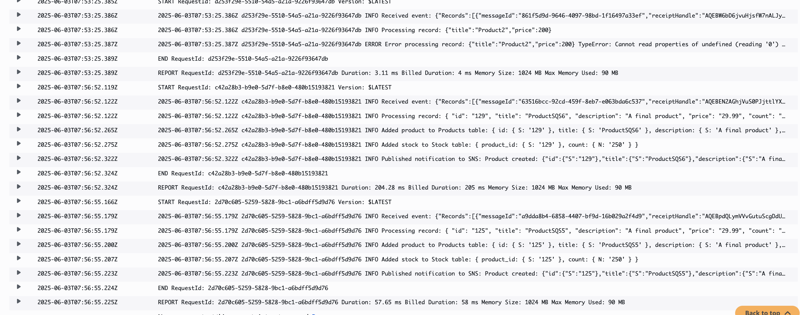
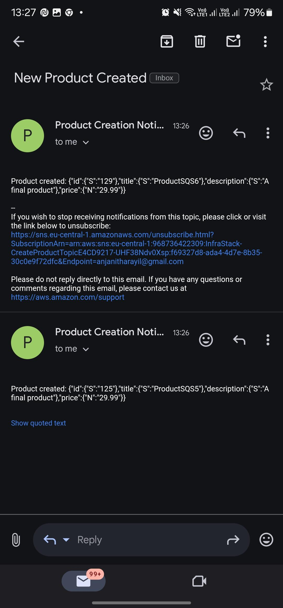
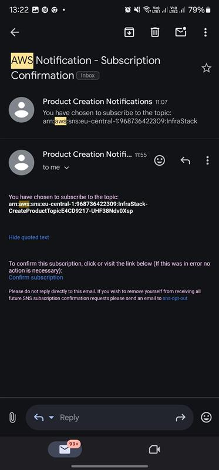

### **Task 6.1 - SQS and Lambda Integration**

#### **Step 1. Send Messages to the SQS Queue**

   
   
   

### **Task 6.2 - CSV File Processing and SQS Integration**

   
   
   

   
### **Task 6.3 - SNS Notifications**

   
   
   