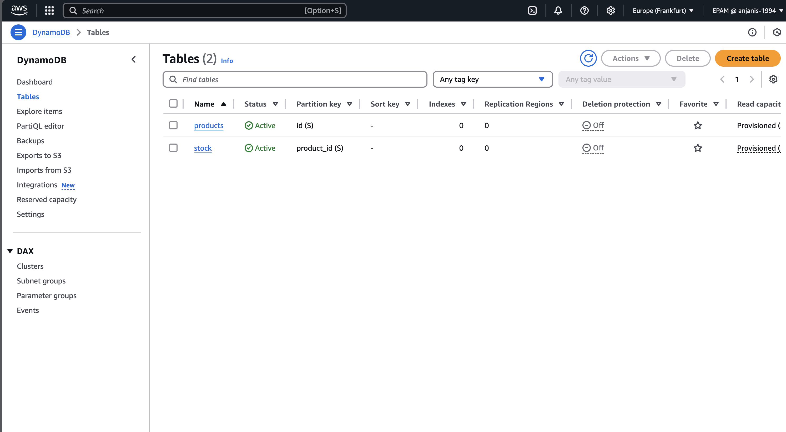
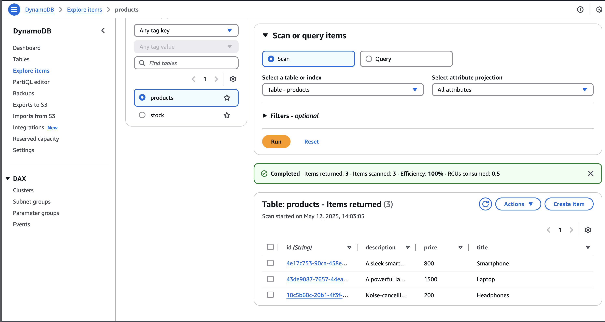
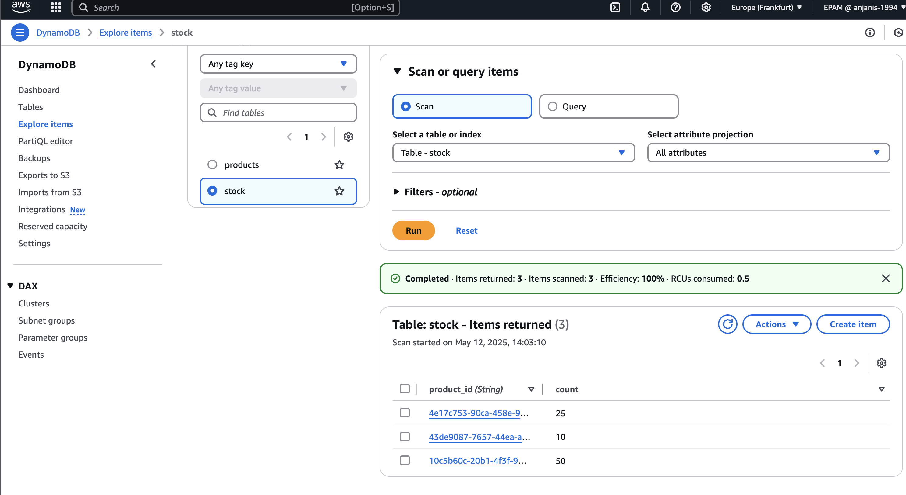

## DynamoDB Setup

### Step 1: Create DynamoDB Tables Using AWS Console

#### Products Table Schema

| Attribute    | Type   | Description             |
|--------------|--------|-------------------------|
| `id`         | UUID   | Primary key             |
| `title`      | String | Product title (required)|
| `description`| String | Product description     |
| `price`      | Number | Product price (required)|

#### Stock Table Schema

| Attribute     | Type   | Description                                        |
|---------------|--------|----------------------------------------------------|
| `product_id`  | UUID   | Foreign key referencing `products.id`              |
| `count`       | Number | Quantity in stock (should not exceed this number)  |

---

### Step 2: Populate Tables with Test Data

A script is included to populate both DynamoDB tables with test data.

#### Script Location

/script-task4.1/index.js

#### Run the Script

npm install
node index.js

### screenshots

## 🔧 DynamoDB Table Creation

The following screenshot shows created `products` & `stock` table:

## Script Execution Output

This is a sample output after running the data population script:

